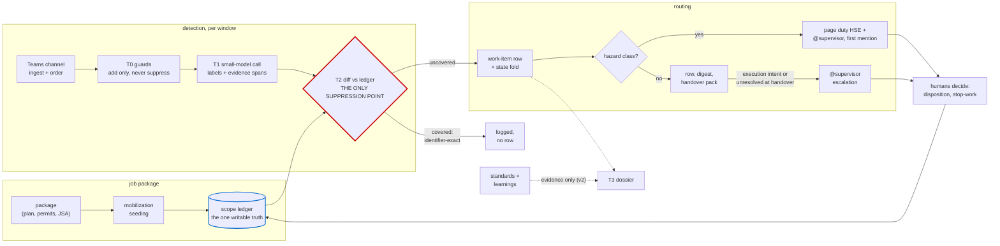
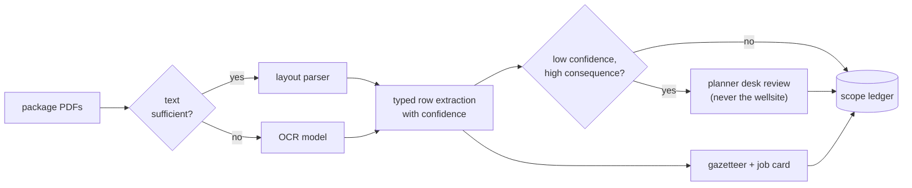
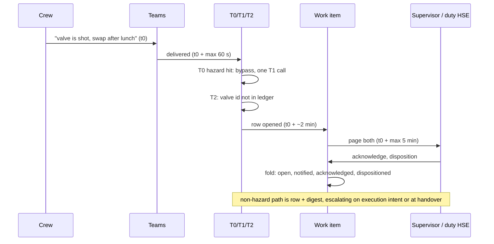
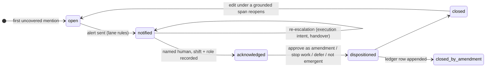
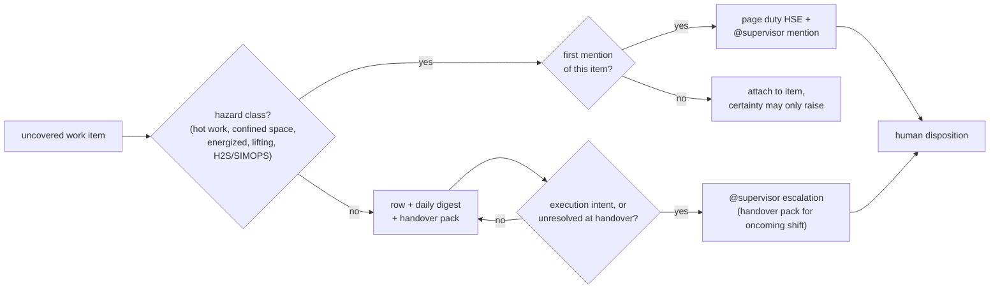

# Emergent Scope Sentinel

Detecting emergent scope risk in field-job chat, early enough for humans to
intervene. Nikhil Singh, 2026-09-02. Part 1 design; the implemented slice is
described in section 9.

---

## The design in brief

**Emergent scope is a diff against approved scope, not a property of a
message.** No classifier can tell that "swap the degraded valve" is emergent
work; the job package can. So the core of this design is a per-job scope
ledger seeded from the package, and detection is a comparison against it.

Crews routinely find extra work once they mobilise (a degraded valve, a
stuck tool), and it gets done inside a job whose permits and hazard review
never covered it. Published turnaround benchmarks report scope growth near
23%; nobody has measured the field-job version, but the mechanism is the
same. The first visible trace is usually a few informal chat lines.

(The same diagram ships full size as `architecture.png`.)

The three decisions that matter most:

1. A live per-job **scope ledger**, seeded from the job package, is the
   reference; detection is a diff against that ledger, and there is no
   per-message classification anywhere.
2. **Model output may never suppress.** Guards and extraction only add
   candidates; the single suppression point is a deterministic,
   identifier-exact match against the ledger.
3. **One row per work item, not per message.** Hazard classes page at first
   mention; everything else becomes a record that escalates on execution
   intent or at shift handover.

Build (v1): package seeding to shallow ledger rows, T0 guards, T1 windowed
extraction, T2 diff, the work-item fold, two-lane alerting, shadow mode
first. Not in v1: streaming infrastructure, the T3 dossier and standards
retrieval (v2), the clustering adjudicator (v2), fine-tuning, autonomous
anything.

Worst failure modes: bad package extraction turning into silent misses
(which is why coarse rows never suppress), alert volume training the field
to mute the tool (budgets and lanes are design inputs here, decided
upfront), and paraphrase evasion (guards feed the model and never gate it).

Validate first: paraphrase-invariant recall with zero suppression, on
planted scenarios authored by someone other than the detector's author.

Week one: poll the channel, one classify call per window, a Postgres row, a
Teams @mention. Shadow mode only.

---

## 1. The problem, and the dumb version that fails

A job's planned scope is safety-reviewed up front: approved work, permits,
JSA hazards, controls. Emergent scope is whatever the crew starts discussing
that this review never covered. That definition is relational. The same
sentence ("we'll swap it after lunch") is routine in one job and a
scope-and-hazard event in another, and nothing in the sentence tells you
which. Any detector that looks only at messages is guessing.

The dumb version is worth writing down because it is what most people, me
included, would build first: run an LLM on every message asking "is this
emergent scope?", and page someone on yes. It breaks in three places.
First, without the reference it cannot even define emergent, so its labels
are guesses about phrasing; the planted
scenario in Part 2 keeps a planned-work message phrased exactly like
emergent work to make this measurable. Second, its alert arithmetic
collapses: at 10^2-10^3 jobs, per-message paging at any realistic precision
buries the people it is meant to protect. And third, whatever the model writes
ends up deciding what gets ignored, which makes the chat channel itself an
injection surface into a safety function. The dumb version survives in this
design as the measured baseline the slice reports against, and as the
honest description of what the system is on day one, before the ledger has
coverage.

One more thing about framing. Permit-to-work regimes already require you
to stop and re-authorise when scope or conditions change; the widely used
industry guidance says exactly this (appendix C). So I am not building an
AI safety judge here. This is a detection layer for a rule that already
exists, and it holds no stop-work authority: it makes the rule's trigger
visible while humans decide.

## 2. Assumptions

Beyond the brief's givens, these are my assumptions, each with what breaks
if it turns out wrong:

1. The job package can be parsed into identifier-bearing rows (work order
   ids, permit numbers, equipment tags) at usable confidence. Where it
   cannot, rows go coarse and never suppress; if that is most of the
   package, v1 degrades to a classifier plus record keeper, honestly
   labeled (this is validation item 1).
2. The supervisor and crew are in the channel, and the supervisor may be
   the one directing the emergent work. This drives the parallel HSE
   addressee on hazard classes.
3. A duty-HSE roster exists, sharded by asset or region at roughly 20-30
   jobs per on-call person.
4. "Planted Job B" is read primarily as a second, unplanned piece of work
   surfacing gradually inside Job A's channel. The alternative reading, an
   adjacent job's work bleeding into this channel, is planted too; the
   slice states what it does with each.
5. "Early enough for humans to intervene" means minutes, not seconds: the
   intervention loop is human, so the latency budget is set by response
   time, not streaming micro-latency.
6. Teams is reachable via the Graph API; the transport is an adapter and
   could be an export or webhook instead.
7. Chat is English-dominant in v1; multilingual crews are a named v2
   concern, not silently ignored.
8. CMMS and permit-system identifiers appear inside the package documents.
   Live integration with those systems is an integration note, not a
   dependency: the brief grants documents, so documents are primary.
9. Retention of chat-derived data follows the operator's existing policy;
   the system stores spans and identifiers, not more.

## 3. Architecture and flows

### 3.1 The scope ledger

At mobilization, the package is parsed once into shallow, typed rows:

    {artifact_type: task | permit | jsa_hazard, identifiers[],
     verb, equipment_class, source: doc/page/span, confidence}

plus a lexical gazetteer (tags, permit numbers, unit names) and a one-card
job summary. Digital PDFs go through a layout parser; scans route to OCR on
a text-sufficiency check, and the JSA hazard and control tables are treated
as the payload, not something to strip out. Both of those are failure modes
I have personally hit in production document pipelines: OCR silently
disabled and yielding empty pages, and table-stripping logic tuned for
contracts deleting exactly the tables we need.

The ledger is live: amendments and dispositions append to it, so "approved
scope" at 14:00 includes what a human approved at 13:40. Standing rules:
coarse rows never suppress, ever; low-confidence, high-consequence rows
queue for a planner's desk review, never for the wellsite.

### 3.2 The detection path

**T0, deterministic guards, free.** Every message is checked against a
marker lexicon (change verbs, "while we're here", "might as well"), the
ledger's identifiers, and an unknown-tag detector. Guards are OR-only: a
hit adds signal and can pull the window forward; no guard ever removes a
message from the model's view. Suppressing here would mean a lexicon gets
veto power over a safety function.

**T1, one small-model call per job window.** The window is N=10 messages or
T=120 seconds, whichever first, because the signal usually spreads across
an exchange ("that valve's shot" ... "we'll swap it after lunch"). A T0
hazard-marker hit bypasses the window with an immediate single-message
call. Output is schema-locked: label (including execution-intent),
severity, evidence span, equipment, action, location, and certainty as a
three-bucket enum. A message with an attachment also carries a
deterministic attachment_present flag, recorded as a guard signal that
nudges the uncovered ranking and never suppresses (reading the image
itself is v2). The model only proposes here;
nothing gets decided at this tier.

**T2, deterministic diff, the only suppression point.** Candidates match
against the ledger's closed identifier set, and the identifier used for
matching is recovered deterministically from the raw message span (regex
over the gazetteer), never taken from a model field, so neither an
embedded instruction nor a mis-extraction can mint a match. Identifier
match marks covered; everything else lands uncovered, ranked by severity,
certainty, and guard signals. Nothing the model wrote can reach the
suppression decision: an extracted phrase like "covered under LOTO-22" is
a claim to verify against the ledger, never an instruction. That is the
injection defence: it comes from the construction, not from a filter.

**T3, escalation dossier (v2).** On escalation, a larger model attaches
standards passages and prior-incident learnings as evidence beside the raw
span. Retrieval runs only after the uncovered ranking exists; it never
decides coverage.

One message end to end, with the latency budget (these numbers are pins I
will defend, and the slice measures the actual distributions; SLO: hazard
page within 5 minutes of message arrival, non-hazard row within 15):

### 3.3 Work items and the fold

Mentions cluster into work items so five messages about one valve are one
row: hard keys first (normalized equipment ids, V-114 equals V114), then
gazetteer soft keys within a bounded merge window. Ambiguous links go to a
single batched adjudication call, and its links sit under the same
pairwise-F1 precision gate as the deterministic ones, because in informal
chat the hard-key fraction may be low, which would quietly make the
adjudicator the primary clusterer; the slice measures that fraction.
Assignment is append-only, splits record lineage, and a wrong merge that
causes a re-alert is scored as an event-level false positive.

The work item's status is a deterministic, versioned fold over its mention
log, so any state is replayable from the record:

Message edits and deletes are first-class: versions append by (graph_id,
etag), deletes tombstone, and an edit under a span that grounded an alert
reopens the item. Insert-only ingestion would silently un-ground alerts.

### 3.4 Alerting: two lanes and the arithmetic

The rule that lets never-suppress and a sane pager coexist: **suppression
governs whether a row exists; budgets govern which rows interrupt.** Most
uncovered items interrupt nobody.

**Hazard lane.** The named hazard classes page at first mention: a
supervisor @mention plus an unconditional parallel page to duty HSE. The
classes and their trigger patterns (verb x equipment class) compile
offline from the enterprise standards and incident learnings, so the list
is the operator's, not mine. The parallel addressee exists because the
supervisor may be directing the drift, and because a Teams acknowledgement
is unauthenticated, so an ack alone never closes a hazard item. The lane
is recall-biased with an 85-90% precision floor: below that, responders
start probability-matching and pages stop working. At these base rates
(hazards are 1-5% of candidates) the floor demands specificity near
99.5%, reachable only because the classes are closed and lexicon-anchored,
and proven in shadow mode before anyone is paged.

**Non-hazard lane.** Row, daily digest, shift-handover pack. It interrupts
only on execution intent ("crane's here, doing it now") or when unresolved
at handover. "Early" for this lane means before execution: the disposition
gate is the intervention point, and the handover is the forcing function.
It is an existing permit-revalidation checkpoint; we are not inventing a
new ritual.

A few things are missing here on purpose. No corroboration counting:
quiet night crews corroborate the least and carry the most risk, so
requiring a second signal inverts the safety gradient (the cost, which I
accept: single-mention items reach the triage queue). No mute: there is "dispositioned by a named
human", and a run of no-action dispositions is itself telemetry. No
per-person flags: flags attach to work items, because a tool the crew
reads as surveillance stops being fed.

The arithmetic, with assumptions labeled (all replaced by shadow-mode
measurement, validation item 3): at 10^3 jobs and 100-300 messages per
job-day, T1 yields an estimated 2-6 candidate mentions per job-day; with a
sparse day-one ledger nearly all stay uncovered, so 2-6 rows per job-day
land in that supervisor's digest: zero interrupts by default. Hazard
first-mentions estimated at 0.05-0.1 per job-day after clustering; sharded
at 20-30 jobs per duty-HSE on-call, that is 1-3 pages per day, 0.5-1.5
per 12-hour shift, against a budget of at most 2, with a flood rule (10
in 10 minutes) and
recurring-nuisance review guarding the tail. If shadow mode measures worse,
the budget holds and the precision floor or sharding moves, never the
reverse.

### 3.5 Platform

The platform is deliberately boring, because a 60-second human loop does
not need sub-second transport. Postgres is the single truth: ledger, message versions, work
items, alert log. Job-window workers pull with SKIP LOCKED, so 10^3
channels are just rows. The Teams adapter uses one tenant-wide Graph
change-notification subscription as a signal (fetch by id on notify) backed
by a per-channel delta reconciler with a hard 60-second ceiling. The
ceiling exists because Graph has no "you missed notifications" lifecycle
event: the poll is the only loss detector, and it never backs off on quiet
channels, because quiet channels are where emergent scope surfaces first.

Sizing and cost (estimates at current published model prices, arithmetic
in appendix D): order 10^5 messages/day yields 0.3-1.5 x 10^5 T1 window
calls, because at field chat rates most windows flush on the 120 s timer
holding 1-3 messages, not a full ten; that is order $50-250/day on the
small model at the sparse extreme, less when chat is bursty, and trivial
either way. T3 dossiers on escalations (order 10^2/day, v2) add about
$1.50/day on the larger one. Reconciliation at the ceiling is ~17 Graph
requests/second sustained; nominal limits allow it on paper, but this is
verified against published Teams throttling tables at build, with
staggered polls and request batching as the fallback. Message export
metering is gone as of 2025 (re-verify at build), though being unmetered
does not mean it is unthrottled.

## 4. What I'd build, what I'd skip, and why

**Build in v1** (two weeks, one engineer): package seeding to shallow rows
plus gazetteer; T0 guards; T1 windowed extraction; T2 diff; the work-item
fold; two-lane alerting through Teams mentions; shadow mode with a review
queue; the eval harness with planted scenarios. That covers the whole
causal chain from package to disposition, kept thin at every step.

**Build in v2, once the measurements justify it:** the T3 dossier and standards
retrieval; the batched clustering adjudicator; suppression beyond
identifier-exact, expanded one coverage decile at a time; multilingual
support; one vision call on attachments inside hazard-gated windows
(crews send photos; "degraded valve" is often an image plus four words).

**Skip, deliberately:** streaming infrastructure and brokers (the axis was
debated with a pre-committed kill rule: if polling meets the human-loop
latency budget at 10^3 jobs, the broker dies; it did); fine-tuning
(prompted small models plus deterministic scoring beat it per dollar at
this shape, and keep the audit trail); autonomous disposition of any
hazard item; permit-system write access; dashboards beyond the review
queue, because the channel is the interface the field already uses.

Strip out every model call and what remains is still a useful workflow
tool: a declare-emergent-scope button, the disposition ledger, the
handover pack. I see that tool as this design's floor rather than a rival
design. The AI layer exists because a crew in the middle of a task does
not stop to file declarations, and the floor is exactly what the system
degrades into, whether it be an empty ledger or the model being down.
Alerts still route and nothing silently vanishes.

## 5. Tradeoffs I considered

For each one: what I chose, what it costs me, and why the alternative
lost.

1. **Ledger diff over standalone classification.** Cost: with an empty
   ledger, day one is honestly a classifier plus record keeper, and the
   design's value is contingent on package extraction quality, which is
   why extraction gets the first validation gate. Classification alone
   lost because "emergent" is undecidable without the reference.
2. **Windowed T1 over per-message calls.** Cost: up to ~2 minutes of added
   latency for non-hazard items, and occasional cross-window splits healed
   by clustering. The hazard bypass removes the cost where it matters.
   Per-message lost: several times the calls for strictly less context.
3. **Deterministic-only suppression over semantic "covered" matching.**
   Cost: high early alert volume and a harder-working review queue, paid
   deliberately in the lane design. Semantic suppression lost: one
   embedding mistake silently kills a real alert (the injection argument
   is in 3.2).
4. **Shallow ledger rows over a deep structured scope object.** Cost:
   narrower "covered" claims and weaker-looking coverage. The deep object
   lost because an index-time extraction error becomes a permanent,
   unfalsifiable miss behind a clean audit trail; judge-time depth keeps
   the raw span beside every decision.
5. **Two lanes over uniform paging.** Cost: a real non-hazard drift can
   legitimately wait until handover; that bound is stated, not hidden
   (before execution, not before mention). Uniform paging lost to
   arithmetic: it kills the pager in a week.
6. **Poll-ceiling reconciler over pure push.** Cost: a standing ~17
   requests/second and up to 60 seconds of worst-case transport lag.
   Pure push lost: silent notification loss is undetectable without the
   poll, and it concentrates in quiet channels (3.5). (There is a seventh,
   corroboration counting; its cost is stated in 3.4 where it belongs.)

## 6. Failure modes I'm worried about

Ranked by how much they worry me.

1. **Silent misses from bad package extraction.** The worst one, because
   from the outside everything looks healthy. Mitigations: coarse rows never suppress; extraction
   confidence gates; planner desk review; suppression expands only per
   audited coverage decile.
2. **Alarm fatigue mutes the tool socially.** Mitigations: the two lanes;
   budgets stated in published alarm-management units; the precision
   floor; the flood rule; no-action-disposition telemetry as an early
   warning.
3. **Paraphrase evasion.** Field phrasing walks past any lexicon.
   Mitigations: guards OR into the model rather than gating it; a
   paraphrase-invariant recall gate with zero suppression as a hard eval
   gate.
4. **Wrong merges in clustering.** A hazard mention absorbed into an
   already-dispositioned item is a silenced alarm. Mitigations in 3.3:
   precision-first link gates, append-only assignment with split lineage.
5. **The conflicted supervisor.** The person notified may be directing the
   drift. Mitigations: unconditional parallel duty-HSE page on hazard
   classes; disposition identity and role recorded.
6. **Edits and deletes under a grounded alert.** Mitigations in 3.3:
   append-only versions, tombstones, reopen on grounded-span edit.
7. **Notification loss and subscription death.** Mitigations in 3.5,
   plus a subscription-kill soak test.
8. **Prompt injection through chat or documents.** Mitigations: chat is
   data, fenced; outputs schema-locked; extracted text can never reach
   the suppression decision or any action.
9. **Fear of reprisal distorts use.** If the tool reads as surveillance,
   the channel goes quiet and the signal dies. Mitigations: flags attach
   only to work items, and there are no per-person metrics anywhere,
   including internal telemetry.

## 7. What I'd validate before committing

In order, because the answers change the design:

1. **Package extraction yield** on real packages: what fraction of scope
   items lands identifier-bearing at usable confidence. If low, the
   ledger goes coarse and v1's claim changes from "diff against approved
   scope" to "classifier plus record keeper", and that has to be said
   upfront, not discovered later.
2. **Paraphrase-invariant recall with zero suppression** on held-out
   plants authored by field supervisors, not by the lexicon's author,
   including negative controls: planned work phrased the way emergent
   work sounds.
3. **Base rates in shadow mode:** messages per job-day, candidate
   mentions, hazard first-mentions, the hard-key fraction. These replace
   every estimate in section 3.4.
4. **The alert arithmetic in the field's units:** pages per on-call
   shift; disposition-before-execution rate against interrupts per
   supervisor-shift.
5. **Suppression earning:** the coverage-decile audit; suppression
   expands one decile at a time, only where misses are provably absent.
6. **Soaks:** subscription kill, edited-span redelivery, wrong-merge rate
   on adversarial clustering fixtures.

Scale honesty: the full program (coverage-decile audits, calibrated
thresholds for the non-hazard ranking, latency-aware detection scoring)
needs volumes far beyond a
43-message sample. The slice claims only what 43 messages support; this
section is the list of what it deliberately does not claim.

## 8. Where each given is used

| Given | Where it does work |
|---|---|
| Job package at mobilization | Seeds the ledger (3.1); its identifiers are the only thing that can suppress (3.2); its extraction quality is validation item 1 |
| Standards + historical learnings | Compiled offline into severity-raising hazard patterns (verb x equipment class) used in T1/T2 ranking; passages attached as T3 evidence (v2); never suppress |
| One channel per job | Per-job window, ledger, and fold; the supervisor-in-the-channel fact shapes the whole alert design (3.4) |
| 10^2-10^3 concurrent jobs | Window batching, poll and cost arithmetic (3.5, appendix D), duty-HSE sharding and budgets (3.4), and the broker kill rule (section 4) |

## 9. Part 2: the slice

The slice is the thin end-to-end detection path, because the design's core
claim lives there: package seed, T0, one T1 window call, T2 diff,
work-item row with the minimal fold, escalation record. Transport is a
replayed JSONL fixture; no clustering adjudicator, no T3.

Data: a synthetic job package (work plan, two permits, a JSA with
hazard/control tables) and 30-80 messages, at least half operational
chatter and noise, including planned-work confusables as negative
controls. The primary Job B plant surfaces across 6-10 messages inside Job
A's channel; 3-5 further messages plant the adjacent-job-bleed reading;
the README states both and what the slice does with each.

Measured outcomes: catch latency for the plant (messages from first
signal, and wall clock against the SLO pins), lexicon-only versus T0+T1
recall delta (the T1 call has to earn its place with a measured delta,
not just assert it), precision on the
noise half, a zero-suppression check (nothing the model wrote suppressed
anything), and the hard-key coverage fraction from 3.3. The paraphrase set
is frozen before any tuning, plant seed material is disjoint from the
lexicon's sources, and results report at least one honest miss.

---

## Appendix A: the decision record, compressed

**A. Detection core.** As section 3.2. Rejected: an agent-with-tools
(unbounded, nondeterministic, injection-exposed at the suppression point)
and a day-one classifier ensemble (deferred as a shadow-labeled cost
optimization once volumes justify it). Execution-intent is a first-class
label because it is the escalation trigger.

**B. Alerting.** The safety property is disposition-before-execution, not
notification: the supervisor is already in the channel, so for non-hazard
drift the alert's job is record creation and a decision before the work
runs. Certainty can raise interrupt probability, never lower it. Rollout
is a ladder, shadow then assisted then autonomous, each gate a measured
number, and the autonomous tier is capped at non-hazard dispositions:
stop-work authority stays with people at every rung.

**C. Grounding.** One record, the ledger, one write path. Depth is bought
at judge time (evidence beside the raw span), not at index time (where
errors become unfalsifiable). "Covered" exists only as identifier-exact
match; everything else is a ranked list with one drainable abstain.
Retrieval attaches evidence only after the uncovered ranking. Per-job
isolation is enforced twice, defense in depth. No chunking inside a job
(packages are small enough to stuff whole sections); chunking effort is
reserved for the shared standards corpus. Certainty derives from
independent deterministic signals, never from the model grading itself.

**D. Platform.** As section 3.5, plus: (createdDateTime, graph_id)
ordering, and ops paging kept separate from safety paging so an infra
incident never masquerades as a field alert.

## Appendix B: productionization (out of v1 scope, one line each)

Credential-split worker processes (ingestor cannot alert; notifier cannot
read raw chat). Deterministic fold replay under a fold_version. DR targets
(RPO/RTO) for the ledger. PII retention TTL on message bodies. Row-level
access by job. Graph protected-API approval path, with a per-team bot and
resource-specific consent as the fallback to verify with the tenant.

## Appendix C: standards and prior-art hooks

Verified in the published texts for this exercise, to be confirmed with
the operator's HSE lead; these are hooks, not practitioner claims.

- Permit-to-work guidance (IOGP Report 577): stop and re-authorize when
  scope or conditions change; no field changes to permits without
  re-submittal. The ledger's row vocabulary follows its field list
  (permit number and duration, JSA task to hazards to controls, roles,
  isolations, SIMOPS, close-out).
- US offshore SEMS regulations (30 CFR 250 Subpart S): JSA (250.1911),
  management of change (250.1912), stop-work authority (250.1930). OSHA
  PSM (1910.119) is deliberately not the hook: well drilling and
  servicing are exempt from it.
- Alarm-rate budgets in published alarm-management units (EEMUA 191 /
  ISA-18.2 practice): sustained rates, flood definition, recurring
  nuisance review.
- Metrics report in the process-safety indicator slot for operating
  discipline (API RP 754 Tier 4 style), as routing decisions, never risk
  predictions: near-zero incident base rates make prediction claims
  indefensible.
- Shift handover as a known loss-of-containment seam (the Piper Alpha
  public inquiry finding): the escalation checkpoint formalizes an
  existing revalidation ritual.
- The ~23% average scope growth figure is from published turnaround
  benchmarking (top-quartile operators hold roughly 8%).

## Appendix D: arithmetic detail (all labeled estimates)

Message volume: 10^3 jobs x 100-300 messages/job-day = 1-3 x 10^5
messages/day. Windows at N=10 / T=120 s: at these rates the mean gap
between messages (5-14 min) exceeds the 120 s timer, so most windows
flush holding 1-3 messages and calls land near messages/2-3, not
messages/10: 0.3-1.5 x 10^5 T1 calls/day. At ~1k input + ~150 output
tokens per call ($1 / $5 per MTok), ~$0.00175 per call: about $50-250/day,
less when chat is bursty. T3 (v2): ~3k input + ~800 output per dossier on
the larger model ($2 / $10) is ~$0.014; at order 10^2 escalations/day,
about $1.50/day. Total model spend at full scale: order $50-250/day,
dominated by T1.

Prompt caching: the small model's minimum cacheable prefix is 4,096
tokens; T1 prompts under that run uncached rather than padded, because
padding every call to reach the minimum costs more than the cache saves
at this call shape, and at 5-14 min message gaps most entries would
outlive the default 5-minute cache TTL anyway, making padded calls mostly
cache writes at a premium. Where a job's lexicon makes the shared prefix
naturally long and traffic is bursty, caching turns on.

Graph load: 10^3 channels / 60 s = ~17 requests/second sustained for the
reconciler; JSON batching (20 per request) reduces it to ~0.85. Verify
against published Teams throttling tables at build.

Alert load: hazard first-mentions at 0.05-0.1 per job-day and 20-30 jobs
per duty-HSE on-call give 1-3 pages per day, 0.5-1.5 per 12-hour shift,
against a budget of at most 2; the flood rule and roster sharding absorb
the tail. Non-hazard: 2-6 digest rows per job-day, zero default
interrupts.

## Appendix E: brief coverage map

| Brief item | Where |
|---|---|
| **R01** short doc + architecture diagram | this document; diagrams in the opening summary and section 3 |
| **R02** decide what matters, defend | the three decisions (opening summary), sections 3-5, appendix A |
| **R03** build / skip / why | section 4 |
| **R04** assumptions | section 2 (**I01**, **I02**, **I03** as items 4-6) |
| **R05** tradeoffs | section 5 |
| **R06** failure modes | section 6 |
| **R07** validate before committing | section 7 |
| **R08** uses the givens (**G01**, **G02**, **G03**, **G04**) | section 8 |
| **R09** stop-work stays with people | sections 1 and appendix A (the ladder) |
| **S01**-**S05** slice, data, plant, README, measurable outcome | section 9 (**S01** path, **S02** data, **S03** both plants, **S04** repo README, **S05** measured outcomes) |
| **D01** PDF, **D02** diagram | this document rendered to PDF; standalone diagram exported with it |
| **D03** repo or zip with README | the repo this document ships in; README written with Part 2 |
| **D04** another week / not done | separate half page, shipped with the repo |
